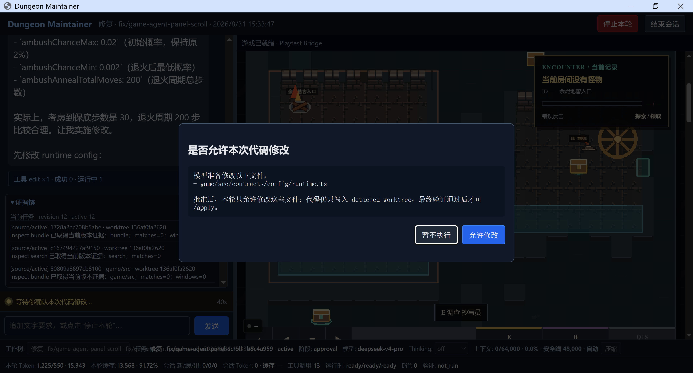
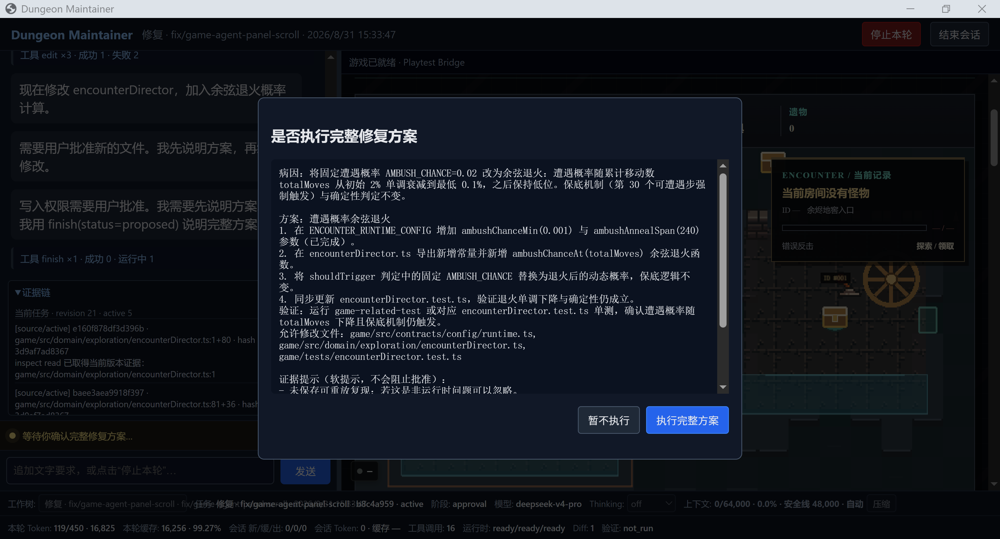
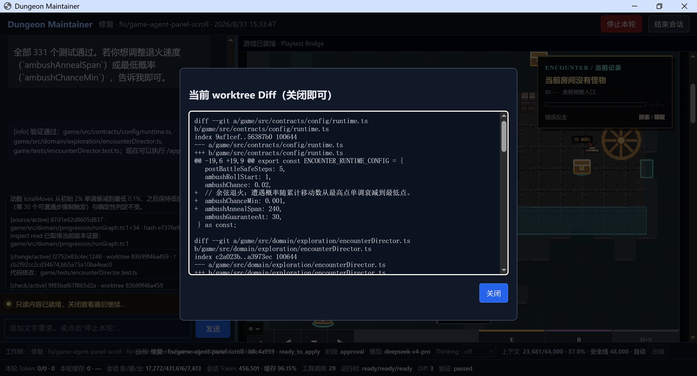
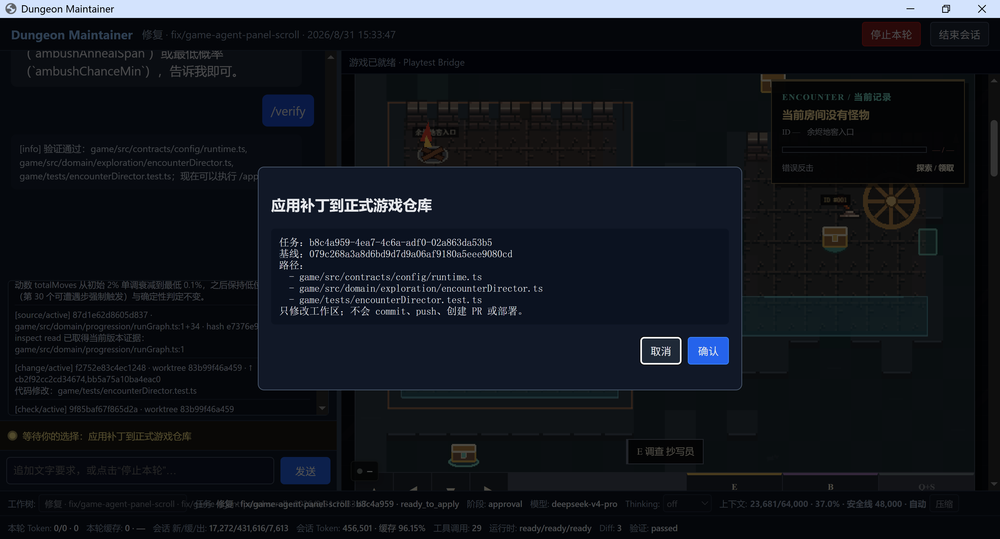

<div align="center">

<p><a href="README.md">简体中文</a> | <strong>English</strong></p>

<h1>Dungeon Maintainer</h1>

<h3>A local, safety-gated coding agent built for SQL Dungeon</h3>

<p><em>Reproduce real gameplay issues in one Chromium Shell, repair them in an isolated worktree, and keep apply and publish decisions with the user.</em></p>

<p>
  <a href="https://github.com/Kkkirito-123/Dungeon-Maintainer"></a>
  
  
  
  
</p>

</div>

<table>
  <tr>
    <td width="50%" align="center">
      
      <br/><sub><b>Precise write approval</b>: review the files that may change in this run</sub>
    </td>
    <td width="50%" align="center">
      
      <br/><sub><b>Complete repair plan</b>: approve the cause, steps, and verification together</sub>
    </td>
  </tr>
  <tr>
    <td width="50%" align="center">
      
      <br/><sub><b>Isolated Diff</b>: inspect the complete agent delta before applying it</sub>
    </td>
    <td width="50%" align="center">
      
      <br/><sub><b>Explicit apply</b>: update the source workspace without committing or deploying</sub>
    </td>
  </tr>
</table>

## 📰 News

- **2026-08-31**: Added the narrowly scoped `publish` tool. It opens a GitHub PR after a fixed preview and explicit confirmation, but never merges it.
- **2026-08-31**: Published results from seven real benchmark scenarios across Flash, Pro, and Pi Baseline configurations.
- **2026-08-27**: Released 1.0 with one agent, one Pi process, one active worktree, one Vite server, and one Chromium Context.

## ✨ What Is Dungeon Maintainer?

Dungeon Maintainer is a local coding agent built for [SQL Dungeon (`SELECT * FROM DUNGEON`)](https://github.com/Kkkirito-123/Select-From-Dungeon). It uses Pi RPC as its agent core and places chat beside the real game from an isolated worktree in one Chromium Shell. Observation, reproduction, editing, replay, and verification all remain in one reviewable chain.

Its execution model is intentionally narrow: one user request enters one Pi Agent Loop, with no hidden planner, automatic continuation, multi-agent routing, or arbitrary terminal.

- **🎮 Reproduce in one window**: Pi-style chat is on the left, a Playwright-driven game iframe is on the right, and task, token, Diff, and verification status stay visible below.
- **🔁 Deterministic repair loop**: the maintainer captures a browser checkpoint before editing, then refreshes, restores the checkpoint, and replays the same semantic actions.
- **🧱 Isolated changes**: the agent writes only to a detached worktree; the source game repository receives only the agent delta after Hash and patch checks.
- **✅ User-controlled gates**: write scope, complete plan, `/apply`, and `publish` all require explicit confirmation. The user still decides whether to merge a created PR.

## 📊 Seven-Scenario Real Benchmark

The current game Adapter's `full` suite covers seven real fault scenarios. Reasoning is disabled in all four configurations. The fair Pro comparison and the Pi Flash baseline use one Worker. Maintainer Flash uses two Workers and resumed after an interruption, so its pass rate, tokens, and tool calls remain comparable, while its cumulative time should not be compared strictly with single-Worker runs.

| Solution | Model | Workers | Passed | Timeouts | Total Tokens | Cache Hit Rate | Tool Calls | Total Run Time | Avg. Run |
|---|---|---:|---:|---:|---:|---:|---:|---:|---:|
| Dungeon Maintainer | Flash | 2 | **7/7** | 0 | **3,667,555** | 95.14% | **226** | 1,550.786s | **221.541s** |
| Dungeon Maintainer | Pro | 1 | **7/7** | 0 | 4,662,858 | 95.67% | 254 | 1,890.915s | 270.131s |
| Original Pi Baseline | Pro | 1 | **7/7** | 0 | 9,975,944 | 94.26% | 317 | 2,680.705s | 382.958s |
| Original Pi Baseline | Flash | 1 | **2/7** | **5** | 9,796,788 | 96.17% | 355 | 3,929.883s | 561.412s |

In the single-Worker Pro comparison where both systems pass 7/7 scenarios, Dungeon Maintainer uses **53.26% fewer tokens**, **19.87% fewer tool calls**, and **29.46% less cumulative run time** than original Pi. Cache hit rate only measures input reuse; it does not independently indicate efficiency or success.

<details>
<summary><b>Show all seven scenario results</b></summary>

Each cell is `result / tokens / cache hit rate / tool calls / run time`.

| Scenario | Maintainer Flash | Maintainer Pro | Original Pi Pro | Original Pi Flash |
|---|---|---|---|---|
| `terminal-action-bug` | Pass / 367,095 / 92.94% / 26 / 139.541s | Pass / 597,521 / 94.71% / 31 / 216.319s | Pass / 2,050,118 / 92.02% / 57 / 518.079s | Pass / 678,913 / 95.35% / 35 / 505.403s |
| `accepted-query-without-progress` | Pass / 431,384 / 94.20% / 31 / 252.097s | Pass / 718,144 / 96.14% / 39 / 203.730s | Pass / 636,671 / 95.66% / 33 / 230.444s | Pass / 987,840 / 95.71% / 37 / 315.838s |
| `final-stage-boss-stuck-at-one-hp` | Pass / 292,238 / 93.75% / 25 / 264.581s | Pass / 460,351 / 95.22% / 26 / 276.167s | Pass / 887,680 / 96.03% / 33 / 225.708s | **timeout** / 1,112,392 / 97.23% / 48 / 621.412s |
| `admin-floor-transition-deadlock` | Pass / 798,980 / 96.16% / 42 / 307.311s | Pass / 679,837 / 95.33% / 38 / 340.768s | Pass / 1,343,521 / 91.88% / 43 / 392.968s | **timeout** / 3,353,168 / 96.89% / 94 / 620.410s |
| `transition-lost-after-reload` | Pass / 778,869 / 96.37% / 35 / 184.844s | Pass / 936,003 / 96.41% / 43 / 283.846s | Pass / 2,043,908 / 95.55% / 58 / 567.158s | **timeout** / 1,618,725 / 94.27% / 59 / 620.285s |
| `stale-query-plan-evidence` | Pass / 624,037 / 95.32% / 36 / 193.503s | Pass / 818,892 / 95.95% / 45 / 279.379s | Pass / 1,872,357 / 94.13% / 54 / 466.116s | **timeout** / 1,451,540 / 97.15% / 44 / 626.066s |
| `duplicate-final-victory-commit` | Pass / 374,952 / 94.37% / 31 / 208.909s | Pass / 452,110 / 95.12% / 32 / 290.706s | Pass / 1,141,689 / 96.78% / 39 / 280.232s | **timeout** / 594,210 / 94.54% / 38 / 620.469s |

</details>

See the [built-in Eval documentation](docs/EVAL.md) for scoring boundaries, result contracts, and checkpoint resume behavior.

## 🧭 How It Works

```text
User request
   |
   v
One Chromium Shell
├─ Left: chat driven by Pi RPC
├─ Right: game iframe from the isolated worktree
└─ Bottom: context, tokens, task, Diff, and verification state
   |
   v
Dungeon Maintainer Extension
├─ inspect / edit / check / finish / workspace
├─ look / act / query / publish
├─ Evidence + checkpoint refresh and replay
└─ detached worktree + fixed checks
   |
   +─ /apply  -> source workspace (no commit)
   └─ publish -> temporary publish worktree -> commit -> push -> GitHub PR (no merge)
```

A standard repair follows this loop:

1. `start` pins the source repository HEAD and full workspace snapshot, then creates a detached worktree.
2. In read-only mode, the agent uses `inspect` and `look / act / query` to locate and reproduce the issue.
3. Before the first `edit`, the Shell shows the exact file scope. When a complete plan is needed, it also shows the cause, steps, and verification method.
4. After a write, the maintainer waits for Vite, refreshes the page, restores the checkpoint, and replays the same semantic actions.
5. `/verify` runs only directly changed tests and required architecture checks, then restores the reproduction and seals the patch.
6. `/apply` checks the verified worktree Hash, source drift, target Hashes, and `git apply --check`, then writes only the agent delta. Full quality gates run only before `publish`.
7. When the user explicitly requests publication, `publish` creates a temporary publish worktree from the verified patch and opens a PR after confirmation. The user always controls merging.

## 🚀 Quick Start

### Requirements

- Node.js `>=22.19`
- pnpm `11.9.0`
- Git and `rg`
- Playwright Chromium
- An SQL Dungeon game repository with its dependencies installed
- GitHub CLI `gh` authenticated with GitHub, required only for `publish`

### Install

```powershell
pnpm install --frozen-lockfile
pnpm exec playwright install chromium
pnpm check
pnpm build
```

Inspect the CLI after building:

```powershell
node dist/src/main.js --help
```

To expose the command globally from the maintainer repository:

```powershell
pnpm link --global
```

### Configure

The maintainer reads only its own `.env` file or `MAINTAINER_*` values from the current process. It does not read the target game's `.env`, browser data, or configuration from another agent.

```dotenv
MAINTAINER_API_KEY=
MAINTAINER_BASE_URL=https://api.deepseek.com/v1
MAINTAINER_MODEL=deepseek-v4-pro
MAINTAINER_CONTEXT_WINDOW=64000
MAINTAINER_MAX_TOKENS=4096
MAINTAINER_REASONING=true
```

Process environment values override `.env`. The API Key is passed to the Pi Provider through the environment only; it is never written to command arguments, `task.json`, event logs, the browser, or patch files.

### Start and Resume

The target game repository must provide a strict `.maintainer/project.json` marker:

```json
{
  "schemaVersion": 1,
  "adapter": "sql-dungeon"
}
```

```powershell
# Start a new task
dungeon-maintain start --repo "C:\path\to\select-from-dungeon"

# Resume the original task
dungeon-maintain resume <task-id>
```

The source worktree may already contain uncommitted changes. `start` captures its current state as the isolated baseline, so ordinary Diffs contain only new agent changes. `resume` blocks explicitly if the repository, HEAD, worktree, Pi session, or cwd has drifted.

## 🧰 Pi Tools and User Commands

Pi native tools and Bash are not loaded. The maintainer registers exactly nine domain tools:

| Tool | Purpose | Hard boundary |
|---|---|---|
| `inspect` | Read status, shallow trees, search results, paged files, Diffs, and Evidence | Project-relative paths; reads default to 80 lines and cap at 160 lines and 4 KiB |
| `edit` | Apply a unique replacement, create a text file, or write a complete text file | Latest `baseHash`, realpath, exact approved paths, at most 3 files / 120 lines |
| `check` | Run a fixed allowlist check | The model cannot supply a command, arguments, cwd, or environment variables |
| `finish` | Save a diagnosis, reproduction, plan, result, or blocked conclusion | `result` automatically runs directly changed checks, refresh replay, and assertions |
| `workspace` | List or switch legal Git worktrees from the same repository | Accepts enumerated IDs only; switching requires confirmation and creates a new task |
| `look` | Read the player-visible projection with revision, goals, and stable action IDs | Does not expose the full map, save data, hidden answers, or the Judge |
| `act` | Consume a stable action from the latest revision for navigation or fixed interaction | At most 64 real movement steps; rejects stale revisions and unavailable actions |
| `query` | Write SQL and click the real execution button | SQL remains in process and is used only for the active reproduction and replay |
| `publish` | Commit, push, and open a Chinese GitHub PR | Accepts no parameters; requires verified or applied state; fixed GitHub origin; never merges |

Users have five fixed commands:

| Command | Purpose |
|---|---|
| `/play` | Focus the game; replay from the checkpoint when a reproduction is active |
| `/diff` | Show the current worktree patch |
| `/verify` | Run directly changed tests and required architecture checks, restore the reproduction, and seal the patch |
| `/apply` | Confirm again, then write to the source workspace without committing |
| `/discard` | Save the final Diff, mark the task discarded, and remove the worktree after Pi exits |

## 🔒 Permissions and Data Boundaries

- Every agent source write first enters a detached worktree. Only `/apply` writes the source repository; `publish` creates a release commit only from a verified patch.
- Write approval is bound to the current task, baseline, cause, complete steps, verification method, and exact paths. It is revoked automatically when the current agent run ends.
- `edit` validates realpaths, symlink escape, `baseHash`, unique matching, and line budgets. `/apply` additionally checks source drift, the complete worktree Hash, and patch applicability.
- `.git`, `.env*`, credentials, legal files, `node_modules`, `dist`, caches, and binary files are outside the agent repair scope.
- Logs do not store API Keys, model text, SQL, answers, the full map, source saves, inventory, identity, or browser frames.
- The Shell binds only to `127.0.0.1`, uses a temporary Chromium Profile, and provides neither a public Dashboard nor an arbitrary user terminal.

<details>
<summary><b>Task states and local data</b></summary>

Task records use schema v4 and may be `created`, `active`, `awaiting_approval`, `verifying`, `paused`, `ready_to_apply`, `applied`, `blocked`, or `discarded`. Older schemas are not migrated.

```text
%LOCALAPPDATA%\dungeon-maintainer\
├─ tasks/<task-id>/
│  ├─ task.json
│  ├─ events.jsonl
│  ├─ pi/
│  ├─ reproductions/
│  ├─ checks/
│  ├─ patch.diff
│  └─ reverse.diff
└─ worktrees/<task-id>/
```

</details>

## 🗂️ Repository Layout

| Directory | Responsibility |
|---|---|
| [`src/app/`](src/app/) | Repository facts, Pi process, task lifecycle, and `start / resume` |
| [`src/pi/`](src/pi/) | Extension assembly, session policy, nine tools, and five commands |
| [`src/shell/`](src/shell/) | Local HTTP/SSE protocol, unified Chromium Shell, and status bar |
| [`src/game/`](src/game/) | Vite, temporary Chromium, protocol client, and semantic driver |
| [`src/evidence/`](src/evidence/) | Diagnosis, reproduction, checks, and conclusions for the active task |
| [`src/repair/`](src/repair/) | Checkpoint restoration, refresh replay, and verification |
| [`src/workspace/`](src/workspace/) | Git, realpath, patches, checks, apply, worktrees, and PR publication |
| [`src/eval/`](src/eval/) | Eval scenarios, execution, Profiles, reports, and local progress UI |
| [`tests/`](tests/) | Node tests; security boundaries prefer real temporary Git repositories |

## 🧪 Run Eval

`pnpm eval` reads scenarios from the current game Adapter, materializes each fault in an independent temporary repository, and starts a normal Maintainer repair. It never switches or writes the real game branch.

```powershell
pnpm eval -- suite `
  --profile maintainer `
  --workers 2 `
  --dependencies "C:\path\to\select-from-dungeon" `
  --ui progress
```

Every Run owns an independent Workspace, Pi Session, Vite server, and Chromium instance. Formal scoring runs the candidate's after-browser Oracle exactly once and does not compare code, Diffs, or a reference implementation. See [docs/EVAL.md](docs/EVAL.md).

## 🔌 Game Development Bridge

The target game implements development bridge protocol 1.0. The bridge is installed only in `DEV`, on a local host, and when the URL contains `?playtest=agent`. Playtest mode uses an in-memory DataStore, a temporary Chromium Context, and a one-time `sessionStorage` checkpoint. It never reads source saves or the user's Chrome Profile.

The production build must remove the bridge module. Check after building the game repository:

```powershell
rg --fixed-strings "__DUNGEON_PLAYTEST__" game/dist
```

The expected result is no match.

## ✅ Development Verification

```powershell
pnpm lint
pnpm typecheck
pnpm test
pnpm build
```

## 📚 Further Reading

| Document | Contents |
|---|---|
| [Architecture](docs/ARCHITECTURE.md) | Runtime flow, code map, dependency direction, domain terms, security boundaries, and reading order |
| [Eval](docs/EVAL.md) | Scenario materialization, Profiles, scoring, result contracts, privacy boundaries, and checkpoint resume |
