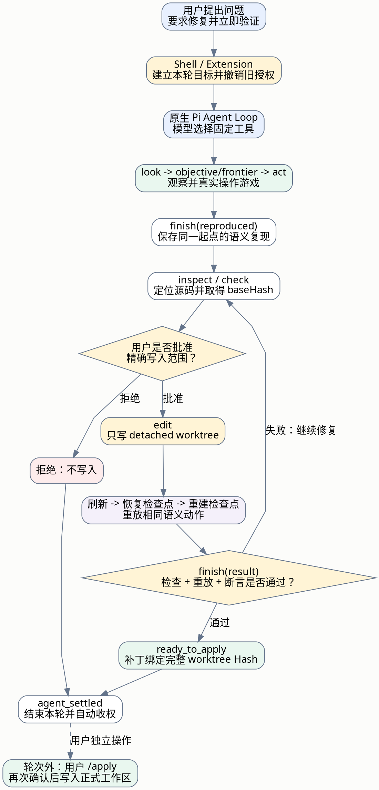
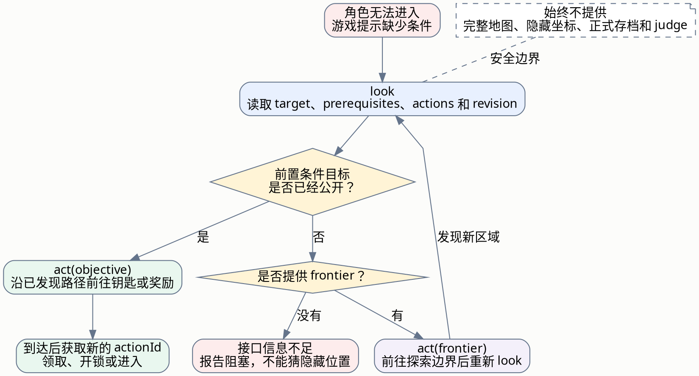

# SQL Dungeon Maintainer 单轮修复流程

本文用于向项目方讲解一次真实的 Agent 修复轮次。内容对应当前代码实现，不把模型没有的
权限描述成已有能力，也不把测试替身描述成真实游戏操作。

## 演示场景

用户提出一个包含明确交付要求的问题：

> 进入下一层失败，游戏提示缺少地下室钥匙。请定位原因、完成修复并立即验证。

这里把“一轮”定义为：用户发送这条自然语言请求，直到 Pi 发出 `agent_settled`。
一个自然语言请求内部可以包含多次模型调用和多次工具调用，但始终只有一个 Pi Agent Loop。

## 一句话讲法

Agent 先通过玩家视角复现问题，再读取相关源码；用户批准精确修改范围后，它只在隔离
worktree 中修复代码，并从同一游戏检查点刷新、恢复和重放相同步骤。验证通过后本轮结束并
自动收回写权限，正式仓库仍需用户单独执行 `/apply`。

## 完整轮次图



完整可编辑图源：[agent-turn-flow.dot](./agent-turn-flow.dot)

## 按图讲解

### 1. 用户请求进入单 Pi 队列

Chromium Shell 同一时刻只接收一个自然语言轮次。空闲时，它通过 RPC 向原生 Pi 发送
`prompt`；轮次运行中追加的文字使用 Pi 原生 steer，固定命令则等待当前轮次结束。

### 2. Extension 建立本轮边界

`input` hook 把文字记录为当前目标。新的修复目标会撤销上一请求的运行时写权限，并使旧的
复现、结论和验证证据退出当前目标；明确要求“继续”时才沿用同一目标。任务、Pi session、
session-dir、cwd 和 detached worktree 始终绑定，不能在轮次中偷换仓库。

### 3. Agent 通过 `look` 读取玩家投影

`look` 不返回完整地图，而是返回完成当前决策所需的有限状态：

- 当前 `floor`、`room`、`mode`、生命值和任务进度；
- 当前任务、提示和玩家可见终端内容；
- 当前 `target` 的类型、名称和 `prerequisites`；
- 当前可用的稳定 `actionId`；
- 标识这份视图版本的 `revision`。

第一次 `look` 同时确保存在源码修改前的游戏检查点。后续不能在故障已经发生的页面上覆盖
这个起点。

### 4. Agent 寻找缺少的进入条件

如果游戏已经公开钥匙或前置奖励，玩家投影会把目标标记为
`prerequisite-reward` 或 `shortcut-key`，并提供 `objective` 动作。Agent 调用：

```text
act(latestRevision, "objective", 64)
```

游戏桥沿已发现的可达路径执行真实移动。若条件位置尚未被发现，投影只提供 `frontier`，
Agent 前往新的探索边界，到达后重新 `look`。它不会读取隐藏房间坐标，也不会扫描完整地图。

详细过程见下方“前置条件导航图”。

### 5. Agent 留下可重放复现

门口仍然提示缺少钥匙后，Agent 用 `finish(status="reproduced")` 保存：

- 预期行为和实际行为；
- 修复后必须满足的结构化断言；
- 从检查点开始的 `look/act/query` 语义动作窗口。

Trace 最多保留 500 条。它记录“前往目标、使用交互、提交查询”这类语义，不记录鼠标坐标、
完整地图、浏览器帧或正式存档。SQL 正文只在当前进程内用于刷新重放。

### 6. Agent 用 `inspect` 定位代码

Agent 使用 `inspect(bundle/read/search)` 获取相关源码窗口和最新 `baseHash`，必要时用 `check`
运行预先登记的诊断。它不能运行任意 Bash，也不能把任意路径交给文件系统。

`baseHash` 表示“Agent 看到并准备修改的正是当前版本”。文件在读取后发生变化时，旧修改会
被拒绝，而不是覆盖新内容。

### 7. 第一次写入必须由用户批准

当前实现有两条入口，但最终进入同一写入范围：

1. Agent 直接调用首次 `edit`，执行层展示精确文件路径并请求批准；
2. Agent 先用 `finish(status="proposed")` 展示完整方案、验证方法和 `allowedPaths`。

批准只绑定当前 `taskId`、`baseHead`、当前请求和精确文件范围。拒绝时不会写入第一字节，
也不会因为工具在模型上下文中可见就绕过门禁。

### 8. `edit` 只修改 detached worktree

写入前，执行层依次检查：

- 项目相对路径、realpath、符号链接和 junction 边界；
- 路径是否属于本轮批准的 writeScope；
- `baseHash`、唯一 `oldText` 和创建文件的 `missing` Hash；
- 单次最多 3 个文件、累计 120 行和 64 KiB 正文预算；
- 敏感目录、凭据内容和一次性审批是否有效。

通过后，补丁只进入任务的 detached worktree。此时正式游戏仓库没有变化。

### 9. 新代码自动刷新并重放相同步骤

存在活动复现时，写入后的顺序固定为：

```text
加载新代码
  -> 刷新游戏 iframe
  -> 消费并恢复原检查点
  -> 立即重建同一起点检查点
  -> 按原顺序重放语义动作
```

如果移动、交互、SQL 输入或页面桥失败，`edit` 返回失败证据并保留 worktree 修改，Agent 可在
同一获批范围内继续修复。失败结果不能被描述为验证通过。

### 10. 用户要求立即验证时提交 `finish(result)`

因为演示请求明确包含“立即验证”，Agent 修改完成后调用 `finish(status="result")`。权威验证器
执行直接改动相关检查、恢复重放和结构化断言，并把结果绑定完整 worktree Hash。全部通过后：

```text
task.state = ready_to_apply
patch.diff 已封装
正式仓库仍未修改
```

隐藏 `judge` 只能由验证层读取，不能作为模型工具调用，也不会把管理员答案返回给 Agent。

如果用户没有要求本轮立即验证，Agent 可以在修改后自然结束，用户稍后用 `/verify` 执行同一
权威验证流程。

### 11. Pi 收敛并自动收权

当模型不再调用工具时，原生 Pi 正常进入 `agent_end` 和 `agent_settled`。Extension 随即：

- 撤销当前请求的内存写权限；
- 关闭持久 writeScope；
- 清理写前 Hash 归因；
- 恢复 Shell 输入控件。

系统不会在 settled 后偷偷追加消息，也不会启动第二个模型轮次。

### 12. `/apply` 位于 Agent 轮次之外

用户检查 Diff 后单独执行 `/apply`。执行层重新检查来源 HEAD、正式工作区洁净度、验证时的
完整 worktree Hash、逐文件 baseHash 和 `git apply --check`。用户再次确认后才把补丁写入
正式工作区；不会自动 commit、push、创建 PR、合并或部署。

## 前置条件导航图



完整可编辑图源：[game-navigation-flow.dot](./game-navigation-flow.dot)

这张图需要强调：Agent 得到的是“下一步任务投影”，不是完整地图。如果游戏既没有返回
`prerequisites`，也没有给出 `objective/frontier`，Agent 必须明确报告语义接口信息不足，
不能凭空推断隐藏条件的位置。

## 角色分工

| 组件 | 负责 | 不负责 |
|---|---|---|
| Chromium Shell | 收发用户请求、展示聊天/游戏/确认框和运行状态 | 不决定 Agent 下一步行为 |
| 原生 Pi | 模型回合、工具调度、steer、abort、retry、compact、settled | 不绕过工具权限直接写仓库 |
| Dungeon Extension | 固定工具、会话绑定、请求收权和工具生命周期 | 不实现第二套 Agent Loop |
| GameDriver | 玩家投影、语义动作、检查点和重放 | 不向模型提供完整地图或隐藏裁判 |
| Inspection | 有界搜索、读取、Diff、Hash 和 Evidence | 不写源码 |
| Safety Gate | 精确路径批准、writeScope 和单轮授权 | 不根据 Prompt 文字假定已授权 |
| Workspace | detached worktree、补丁、检查、apply 和 publish | 不自动 merge 或部署 |
| Verification | 固定检查、重放、断言和完整 Hash 绑定 | 不相信模型口头声明通过 |

## 两分钟讲解稿

> 用户提出“缺少钥匙导致无法进入下一层，请修复并立即验证”。系统首先把请求交给原生 Pi，
> 仍然使用 Pi 自己的模型循环。Agent 通过 look 读取当前玩家状态、缺少条件和可用动作；如果
> 钥匙位置已经公开，就选择 objective 前往目标，如果还没发现，就选择 frontier 逐步探索。
> 它始终只看玩家投影，不读取完整地图。
>
> 问题复现后，系统保存从检查点开始的语义动作。Agent 再通过 inspect 读取相关源码并获得
> 文件 Hash。第一次准备修改时，界面向用户展示精确文件范围；批准后，edit 仍要检查路径、
> realpath、Hash、补丁规模和敏感内容，并且只写任务自己的 detached worktree。
>
> 写入完成后，右侧游戏加载新代码，从同一个检查点恢复，再重放刚才完全相同的操作。因为
> 用户要求立即验证，系统继续运行直接相关检查和结构化断言，全部通过才产生可应用补丁。
> 本轮结束时写权限自动撤销。最后是否写回正式仓库，仍由用户通过 /apply 再确认一次。

## 代码对应关系

| 流程 | 当前实现 |
|---|---|
| 单请求、steer、settled 和输入恢复 | [`src/shell/server.ts`](../../src/shell/server.ts) |
| 新请求目标、旧授权撤销、settled 收权 | [`src/pi/request-lifecycle.ts`](../../src/pi/request-lifecycle.ts) |
| Pi hooks 与九工具装配 | [`src/pi/extension.ts`](../../src/pi/extension.ts) |
| 玩家投影字段 | [`src/game/protocol.ts`](../../src/game/protocol.ts) |
| `look/act/query` 模型工具 | [`src/pi/tools/game.ts`](../../src/pi/tools/game.ts) |
| 检查点、语义动作和刷新重放 | [`src/game/driver.ts`](../../src/game/driver.ts) |
| 源码读取和 `baseHash` | [`src/pi/tools/inspect.ts`](../../src/pi/tools/inspect.ts) |
| 首次写入授权 | [`src/pi/tool-safety-gate.ts`](../../src/pi/tool-safety-gate.ts) |
| 受限写入和写后重放 | [`src/pi/tools/patch.ts`](../../src/pi/tools/patch.ts) |
| 复现、方案和 result | [`src/pi/tools/finish.ts`](../../src/pi/tools/finish.ts) |
| 权威验证 | [`src/repair/verification.ts`](../../src/repair/verification.ts) |
| 用户最终写回 | [`src/pi/commands/apply.ts`](../../src/pi/commands/apply.ts) |
